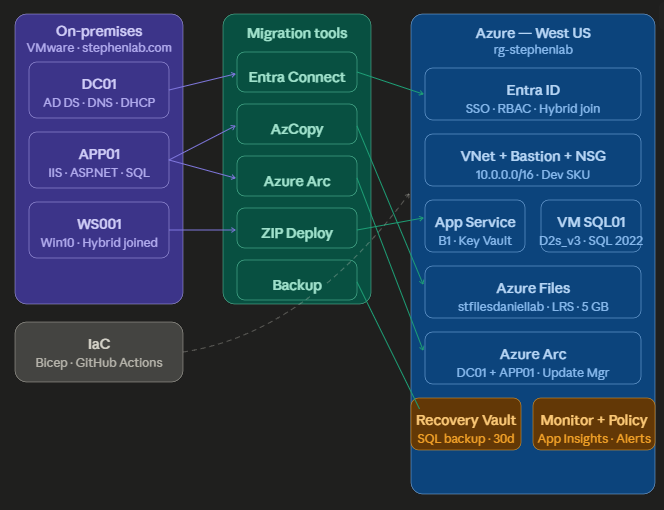

# Homelab — On-Premises to Azure Migration Lab

A end-to-end migration lab built on VMware, migrating a 3-VM on-premises 
environment to Azure using real enterprise tooling.

## Architecture

| Component       | On-premises        | Azure target             |
|-----------------|--------------------|--------------------------|
| Identity        | AD DS on DC01      | Entra ID (hybrid)        |
| Web app         | IIS + ASP.NET      | App Service (B1)         |
| Database        | SQL Server 2022    | VM SQL01 (D2s_v3)        |
| File server     | SMB share          | Azure Files (LRS, 5 GB)  |
| Management      | GPO + WSUS         | Azure Arc + Update Mgr   |

## Phase status

| Phase | Description                          | Status      |
|-------|--------------------------------------|-------------|
| 1     | Hybrid identity + RBAC               | ✅ Complete |
| 2     | Networking (VNet · Bastion · NSG)    | ✅ Complete |
| 3     | Azure Arc (DC01 + APP01)             | ✅ Complete |
| 4     | Azure Update Manager                 | ✅ Complete |
| 5     | VM SQL Server 2022 + Bastion access  | ✅ Complete |
| 6     | App Service+KeyVault+Managed Identity| ✅ Complete |
| 7     | File Server → Azure Files (AzCopy)   | ✅ Complete |
| 8     | Backup (SQL + App Service)           | ✅ Complete |
| 9     | Security·Monitor·Policy·App Insights | ✅ Complete |
| 10    | IaC + GitHub Actions CI/CD           | ✅ Complete |

## Tech stack
- VMware Workstation Pro
- Windows Server 2022
- Azure (westus) — rg-stephenlee91
- Terraform + Bicep + ARM
- GitHub Actions CI/CD

## How to use this repo
Each phase folder in `/phases` contains the objective, prerequisites, 
step-by-step commands, and validation checks. Scripts are in `/scripts`.
